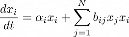

<!-- README.md is generated from README.Rmd. Please edit that file -->

# CommunitySim

<!-- badges: start -->

[](https://github.com/yuan-yin-truly/CommunitySim/actions)
<!-- badges: end -->

CommunitySim simulates an ecological community, such as a microbiome
using Lotka-Volterra based models. In particular, dynamics of species
are simulated assuming a third species can influence the intensity of
pairwise interactions, an assumption referred to as a higher-order
interaction.

<center>

</center>

## Introduction

Lotka-Volterra describes the change of abundance of species relating to
the abundance of all members in the community:



where alpha_i is species i’s growth rate without the influence from
other species; b_ij is the impact of other species on the growth of i,
on a per unit basis.

The higher-order interaction states that a third species can not only
interact with other species pairwise, but also influence the intensity
of the pairwise interaction, which is modeled by b_ij:


Here the pairwise interaction intensity is modeled as a flat rate
modified by the abundance of third species, x_k.

With varying interaction intensity and initial abundance of species, the
change in abundance of the community over time can be studies by solving
the coupled ODEs. This package provides a simulation of above stated
parameters, and a solver for the coupled ODEs.

## Installation

You can install the development version from
[GitHub](https://github.com/) with:

``` r
# install.packages("devtools")
devtools::install_github("yuan-yin-truly/CommunitySim")
```

## How to use

Please refer to the vignette with the command:

``` r
vignette("CommunitySim")
```
